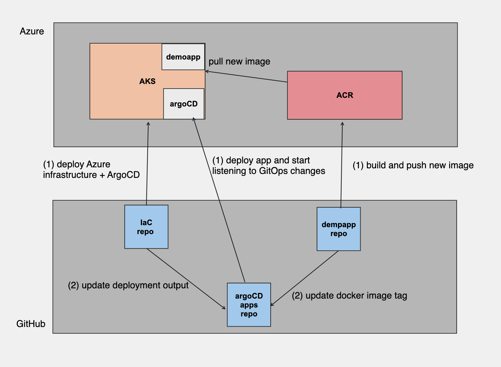

# argocd-apps-config

## tl;dr
This repo is one of three related repos:
- [IaC repo](https://github.com/MSFT-MCSEMEA-Demo/DevOpsDemo) - deploying relevant services to Azure
- [argoCD apps](https://github.com/MSFT-MCSEMEA-Demo/argocd-apps-config) - deploying argoCD apps 
- [DemoApp](https://github.com/MSFT-MCSEMEA-Demo/devops-demo-app) - deploying demoapp (Go)
  
The goal is to demonstrate a complete CI/CD pipeline using GitHub Actions implmenting DevSecOps practices using GitHub Advanced Security tools: Code Scanning (CodeQL), dependency review (depandadbot) and secret scanning. 
Additional security scanning which being used in the demo are:
1. IaC check using [Checkov](https://www.checkov.io/)
2. Container image scanning the demo using [Aqua Trivy](https://github.com/aquasecurity/trivy)

## solution diagram

## pre-requisites
1. Azure subscription
2. Configure OpenID Connect in Azure. After completing the instructions, the following secrets should be created in your repo secrets: AZURE_CLIENT_ID, AZURE_SUBSCRIPTION_ID, AZURE_TENANT_ID - you will need to add three entries for each 'Environment' types: demoapp_dev and demoapp_prod

## repo review
1. global : global configuration files which hold the resource-group and kubernetes cluster names
2. helm/* : application to be deployed (helm)
   - dynamic folder : argoCD app will listen for this folder changes - container registry and container image tag 
3. .github/workflows: github actions files
  - deployArgoApp.yaml : deploy the argoCD application - demoapp

